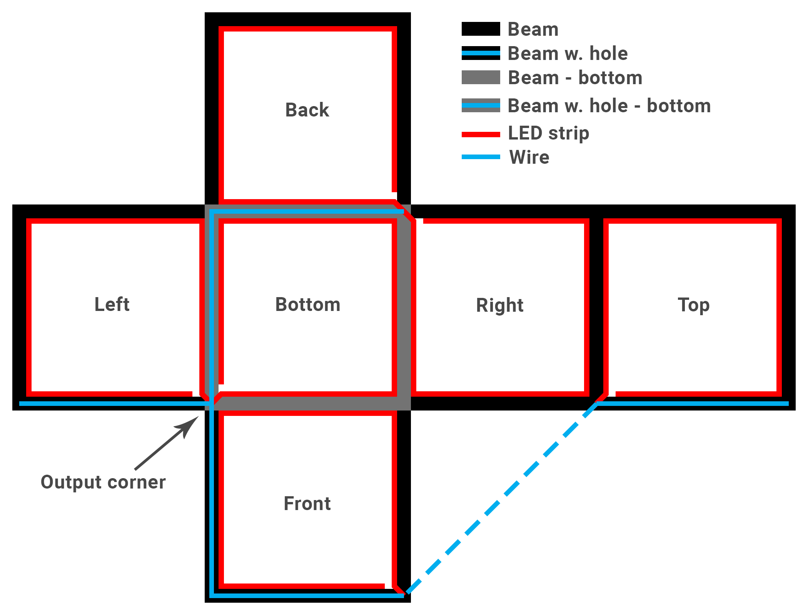

# HyperCube

Homemade clone of the [HyperCube by the Hyperspace Lighting Company](https://www.hyperspacelight.com/the-hypercube).

## Parts list

### 3D printed parts

- 5 beam.stl
- 2 beam-w-hole.stl
- 2 beam-bottom.stl (one symmetry !)
- 2 beam-w-hole-bottom.stl (one symmetry !)
- 4 corner.stl
- 4 corner-bottom.stl
- 5 corner-cover.stl
- 1 corner-cover-cable.stl
- 1 electronics-case.stl
- 1 support.stl (optional)

In doubt you can replace all beam variants by :
- 8 beam-w-hole.stl
- 4 beam-w-hole-bottom.stl (two symmetries !)

The no-hole variants use less material and are faster to print.

### Hardware

- 6 210mm square one-way mirrors (or standard glass/PMAA with one-way film)
- 24 M2.5 15mm wood screws

### Electronics

- 6 80mm WS2812 LED strips (60 LEDS/m)
- 1 Arduino Nano
- 1 10A 5V power supply
- three connectors wire

## Assembly

Special care must be put in the orientation of each LED strips and the placement of each beam.

- The 6 LED strips are wired in parallel and must be in the same direction on the two sides of each beam (the direction changes every 20cm in the code).
- All wires must output on the same corner.
- All strips must be glued and the wires passed through the holes before puting the bottom panel.

The following diagram shows one way to arrange things (flattened cube seen from top).  

## License

The SolidWorks files and Arduino code are distributed under the Creative Commons 3.0 BY-SA license.
